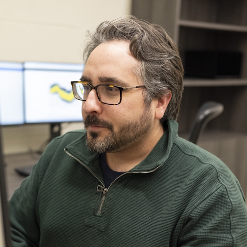

```{=html}
<nav aria-label="breadcrumb">
  <ol class="breadcrumb">
    <li class="breadcrumb-item"><a href="../../index.html">Home</a></li>
    <li class="breadcrumb-item"><a href="../../people.html">People</a></li>
    <li class="breadcrumb-item active">Research Staff</li>
    <li class="breadcrumb-item active" aria-current="page"></li>
  </ol>
</nav>
```

<style>#title-block-header { display: none; }</style>

<header class="profile-head"><div class="profile-id"><h1>Jeffrey Girard</h1><p class="role">Lab Director · Associate Professor of Psychology<span class="when"> · since Fall 2020</span></p><div class="plinks"><a class="plink" href="https://www.jmgirard.com" target="_blank" rel="noopener"><i class="bi bi-link"></i>website</a><a class="plink" href="girard_cv.pdf"><i class="bi bi-file-earmark-text"></i>vitae</a><a class="plink" href="https://scholar.google.com/citations?user=N2UcZ84AAAAJ" target="_blank" rel="noopener"><i class="bi bi-mortarboard"></i>scholar</a><a class="plink" href="https://www.github.com/jmgirard" target="_blank" rel="noopener"><i class="bi bi-github"></i>github</a><a class="plink" href="https://www.twitter.com/jeffreymgirard" target="_blank" rel="noopener"><i class="bi bi-twitter"></i>twitter</a></div></div></header>


## Biography
Dr. Jeffrey Girard studies how emotions are expressed through verbal and nonverbal behavior, as well as how interpersonal communication is influenced by individual differences (e.g., personality and mental health) and social factors (e.g., culture and context). This work is deeply interdisciplinary and draws insights and tools from various areas of social science, computer science, statistics, and medicine.

He completed his doctoral training under the mentorship of Dr. Jeffrey Cohn (nonverbal behavior, machine learning, depression) and Dr. Aidan Wright (interpersonal functioning, statistics, personality). He then completed his predoctoral clinical internship at the University of Mississippi Medical Center (inpatient psychiatry, trauma treatment, neuropsychology) and a two-year postdoctoral research fellowship at Carnegie Mellon University under the mentorship of Dr. Louis-Philippe Morency (verbal behavior, machine learning, computer science). 

He is now an Associate Professor in the department of Psychology at the University of Kansas, where he directs the Affective Communication and Computing lab and the Brain, Behavior, and Quantitative Science (BBQ) program. He teaches undergraduate and graduate courses on psychological assessment, data science, and statistics within the department and is a co-founder of [SMaRT Workshops](https://www.smart-workshops.com), which offers numerous methodological training workshops to faculty and students. He is also the developer and maintainer of numerous open-source research software packages (see [Resources](../../resources.qmd)).

## Experience

::: {.timeline}
- **University of Kansas** | Lawrence, KS, USA<br />
  Associate Professor of Psychology | 2025–Current<br />
  Assistant Professor of Psychology | 2020–2025<br />
  Wright Faculty Scholar | 2020–2025<br />
  Director of the [BBQ Doctoral Program](https://psychology.ku.edu/bbq) | 2022–2026<br />
  Co-Director of the [Kansas Data Science Consortium](https://data.ku.edu) | 2023–2026

- **Carnegie Mellon University** | Pittsburgh, PA, USA<br />
  Postdoctoral Researcher, School of Computer Science | 2018–2020

- **University of Mississippi Medical Center** | Jackson, MS, USA<br />
  Clinical Intern, Department of Psychiatry | 2017–2018
:::

## Business

::: {.timeline}
- **Girard Consulting LLC** <a href="https://www.jmgirard.com" target="_blank" rel="noopener noreferrer"><i class="bi bi-box-arrow-up-right ms-1"></i></a><br />
  Founder | Measurement and evaluation consulting

- **SMaRT Workshops LLC** <a href="https://smart-workshops.com" target="_blank" rel="noopener noreferrer"><i class="bi bi-box-arrow-up-right ms-1"></i></a><br />
  Co-Founder | Online workshops in statistics, methods, and research training

- **Fluid Concepts Research** <a href="https://fluidconcepts.ai" target="_blank" rel="noopener noreferrer"><i class="bi bi-box-arrow-up-right ms-1"></i></a><br />
  Principal Scientist | A data lab focused on Human–AI interaction
:::


## Selected Publications

<ul class="mini-pubs"><li><span class="star" title="Led by our lab">★</span><a href="https://osf.io/preprints/psyarxiv/63sw4_v3" target="_blank" rel="noopener">Evaluating Open-Weight Large Language Models for Structured Depression Assessment from Clinical Interviews</a><span class="meta">Girard, Kebe, Morency, De La Torre, Liebenthal &amp; Baker · Journal of Psychopathology and Clinical Science · in press</span></li><li><span class="star" title="Led by our lab">★</span><a href="https://doi.org/10.31234/osf.io/jeuyk_v1" target="_blank" rel="noopener">Building Open Science into Graduate Training in Clinical Psychology</a><span class="meta">Girard · Clinical Psychological Science · in press</span></li><li><span class="star" title="Led by our lab">★</span><a href="https://doi.org/10.1007/s42761-025-00352-7" target="_blank" rel="noopener">Sentiment Analysis of Naturalistic Speech Using Open-Weight Large Language Models</a><span class="meta">Girard, Jun, Ong, Liebenthal &amp; Baker · Affective Science · 2026</span></li><li><span class="star" title="Led by our lab">★</span><a href="https://doi.org/10.1146/annurev-clinpsy-081423-024140" target="_blank" rel="noopener">Computational Analysis of Expressive Behavior in Clinical Assessment</a><span class="meta">Girard, Yermol, Salah &amp; Cohn · Annual Review of Clinical Psychology · 2026</span></li><li><span class="star" title="Led by our lab">★</span><a href="https://doi.org/10/g824tc" target="_blank" rel="noopener">From Intuition to Innovation: Empirical Illustrations of Multimodal Measurement in Psychotherapy Research</a><span class="meta">Aafjes-van Doorn &amp; Girard · Psychotherapy Research · 2025</span></li><li><span class="star" title="Led by our lab">★</span><a href="https://doi.org/10/g8pwmn" target="_blank" rel="noopener">Transdiagnostic Modeling of Clinician-Rated Symptoms in Affective and Nonaffective Psychotic Disorders</a><span class="meta">Chung, Girard, Ravichandran, Öngür, Cohen &amp; Baker · Journal of Psychopathology and Clinical Science · 2025</span></li><li><span class="star" title="Led by our lab">★</span><a href="https://doi.org/10.1037/ccp0000980" target="_blank" rel="noopener">Dynamic and Dyadic Relationships between Facial Behavior, Working Alliance, and Treatment Outcomes during Depression Therapy</a><span class="meta">Girard, Yermol, Bylsma, Cohn, Fournier, … &amp; Swartz · Journal of Consulting and Clinical Psychology · 2025</span></li><li><span class="star" title="Led by our lab">★</span><a href="https://doi.org/10.1002/jts.23023" target="_blank" rel="noopener">Associations between Transdiagnostic Traits of Psychopathology and Hybrid Posttraumatic Stress Disorder Factors in a Trauma-Exposed Community Sample</a><span class="meta">Sprunger, Girard &amp; Chard · Journal of Traumatic Stress · 2024</span></li></ul>
<p class="mini-pubs-more"><a href="../../publications.html">See all lab publications</a></p>


## Education

::: {.timeline}
- **University of Pittsburgh** | Pittsburgh, PA, USA<br />
  PhD in Psychology (Clinical) | 2013–2018

- **University of Pittsburgh** | Pittsburgh, PA, USA<br />
  MS in Psychology (Clinical) | 2010–2013

- **University of Washington** | Seattle, WA, USA<br />
  BA in Psychology & Philosophy (Honors) | 2005–2008 
:::

## Journal Editing

::: {.timeline}
- **NPP Digital Psychiatry and Neuroscience** <a href="https://www.nature.com/dpn/" target="_blank" rel="noopener noreferrer"><i class="bi bi-box-arrow-up-right ms-1"></i></a><br />
  Consulting Editor | 2023–Current
- **Journal of Psychopathology and Clinical Science** <a href="https://www.apa.org/pubs/journals/abn" target="_blank" rel="noopener noreferrer"><i class="bi bi-box-arrow-up-right ms-1"></i></a><br />
  Consulting Editor | 2023–Current
- **IEEE Transactions on Affective Computing** <a href="https://www.computer.org/csdl/journal/ta" target="_blank" rel="noopener noreferrer"><i class="bi bi-box-arrow-up-right ms-1"></i></a><br />
  Associate Editor | 2022–2025
- **Collabra Psychology** <a href="https://online.ucpress.edu/collabra" target="_blank" rel="noopener noreferrer"><i class="bi bi-box-arrow-up-right ms-1"></i></a><br />
  Associate Editor | 2021–2026
- **Clinical Psychological Science** <a href="https://journals.sagepub.com/home/cpx" target="_blank" rel="noopener noreferrer"><i class="bi bi-box-arrow-up-right ms-1"></i></a><br />
  Consulting Editor | 2021–Current
- **Psychological Assessment** <a href="https://www.apa.org/pubs/journals/pas" target="_blank" rel="noopener noreferrer"><i class="bi bi-box-arrow-up-right ms-1"></i></a><br />
  Consulting Editor | 2020–2022
:::


