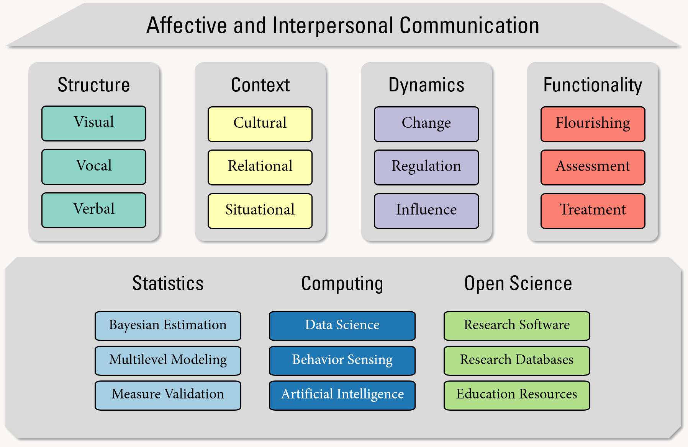

```{=html}
<nav aria-label="breadcrumb">
  <ol class="breadcrumb">
    <li class="breadcrumb-item"><a href="index.html">Home</a></li>
    <li class="breadcrumb-item active" aria-current="page">Research</li>
  </ol>
</nav>
```

## Research Framework

{fig-alt="Diagram of the lab research framework linking behavior, measurement, and mental health"}

### Substantive Pillars

The substantive focus of our work is on how humans communicate important affective and interpersonal information to one another. The four pillars of this work are on structure, context, dynamics, and functionality. In studying **structure**, we investigate the production and perception of visual behaviors (e.g., facial expressions, gestures, and body motion), vocal behaviors (e.g., pitch, loudness, and timbre), and verbal behaviors (e.g., syntax, semantics, and discourse). In studying **context**, we investigate the influence of cultural, relational, and situational factors. In studying **dynamics**, we investigate change over time, regulation, and how processes and individuals influence one another. Finally, in studying **functionality**, we investigate how communication interfaces with health, clinical assessment, and treatment.

### Methodological Foundation

Supporting these pillars is a wide foundation of interdisciplinary methodology. The three main aspects of this foundation are statistics, computing, and open science. The **statistical** aspects largely focus on Bayesian estimation, multilevel (mixed-effects) modeling, and measurement validation. The **computational** aspects largely focus on data science (data wrangling and visualization), behavior sensing (computer vision, signal processing, and natural language processing), and artificial intelligence (machine learning and large language models). Finally, the **open science** aspects largely focus on research software, research databases, and educational resources.

## Research Funding

### Current Funding

::: {.grant-list}
::: {.grant-card}
[R34]{.grant-tag} Developing and Evaluating a Firefighter Self-Administered Neurostimulation Intervention for Traumatic Stress to Reduce Alcohol Use

[[National Institutes of Health (NIAAA)]{.grant-funder} [05/2026 -- 04/2029]{.grant-when}]{.grant-line}[Sprunger (PI), Co-I: **Girard**]{.grant-people}
:::

::: {.grant-card}
[DoD]{.grant-tag} Assessment of Eating Disorder and Comorbidity Risk and Resilience in Recent Military Enlistees

[[Department of Defense]{.grant-funder} [04/2025 -- 03/2027]{.grant-when}]{.grant-line}[Forbush (PI), Co-I: **Girard**]{.grant-people}
:::

::: {.grant-card}
[R34]{.grant-tag} Building Healthy Eating and Self-Esteem Together for University Students (BEST-U): A Pilot Randomized Controlled Trial of an mHealth Intervention for Binge-Spectrum Disorders

[[National Institutes of Health (NIMH)]{.grant-funder} [01/2025 -- 12/2027]{.grant-when}]{.grant-line}[Forbush, Christensen-Pacella (PIs), Co-I: **Girard**]{.grant-people}
:::

::: {.grant-card}
[P20]{.grant-tag} COBRE Computational Assessment of Communicative Behaviors in Posttraumatic Stress

[[National Institutes of Health (COBRE)]{.grant-funder} [01/2025 -- 12/2026]{.grant-when}]{.grant-line}[**Girard** (PI)]{.grant-people}
:::

:::

### Completed Funding

::: {.grant-list .completed}
::: {.grant-card}
[R01]{.grant-tag} Context-Adaptive Multimodal Informatics for Psychiatric Discharge Planning

[[National Institutes of Health (NIMH)]{.grant-funder} [04/2021 -- 02/2025]{.grant-when}]{.grant-line}[Baker (PI), Co-Is: **Girard**, Morency]{.grant-people}
:::

::: {.grant-card}
[NSF]{.grant-tag} Kansas Data Science Training Pathways | An Integrated Model

[[National Science Foundation (EPSCoR REI)]{.grant-funder} [01/2024 -- 12/2024]{.grant-when}]{.grant-line}[**Girard** (PI)]{.grant-people}
:::

::: {.grant-card}
[Google]{.grant-tag} Novel Scalable Mental Health Screening Procedures on Ubiquitous Sensing Devices

[[Googler-Initiated Grant]{.grant-funder} [11/2022]{.grant-when}]{.grant-line}[**Girard** (PI)]{.grant-people}
:::

::: {.grant-card}
[R21]{.grant-tag} Multimodal Dynamics of Parent-Child Interactions and Suicide Risk

[[National Institutes of Health (NIMH)]{.grant-funder} [09/2022 -- 07/2023]{.grant-when}]{.grant-line}[Burke (PI), Co-Is: **Girard**, Li, Morency]{.grant-people}
:::

::: {.grant-card}
[PHDA]{.grant-tag} Towards Automated Multimodal Behavioral Screening for Depression

[[Pittsburgh Health Data Alliance (CMLH)]{.grant-funder} [03/2019 -- 02/2021]{.grant-when}]{.grant-line}[Morency (PI), Co-I: **Girard**]{.grant-people}
:::

::: {.grant-card}
[NSF]{.grant-tag} Dyadic Behavior Informatics for Psychotherapy Process and Outcome

[[National Science Foundation (IIS, SCH)]{.grant-funder} [09/2020 -- 08/2022]{.grant-when}]{.grant-line}[Cohn, Morency, Swartz (PIs), Co-Is: Bylsma, Fournier, **Girard**]{.grant-people}
:::

:::
